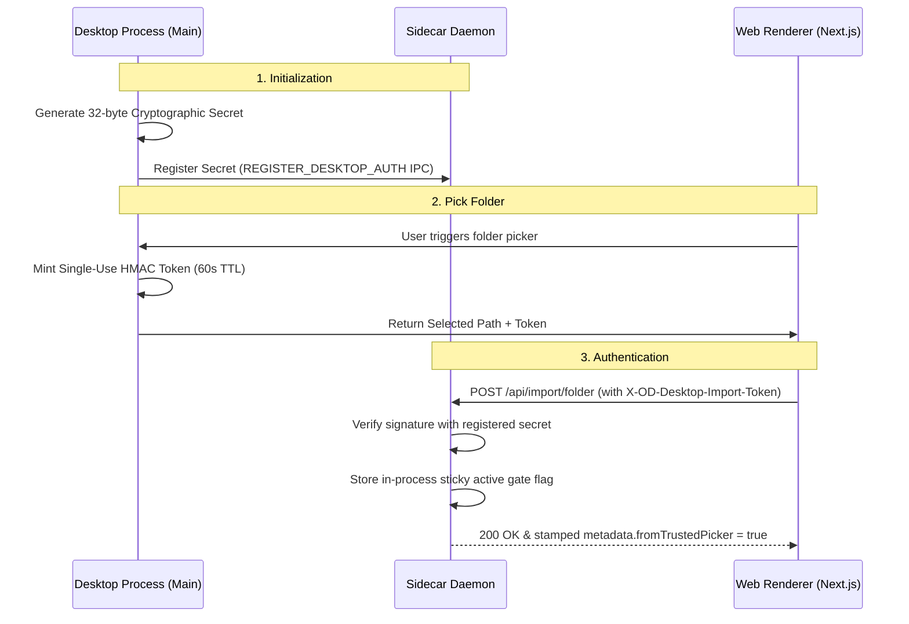

# Maro (Open Design Integration)

**Maro** is the agentic representation and master operational manual for **Open Design** (github.com/nexu-io/open-design). It is a local-first, open-source alternative to proprietary AI design systems. This skill enables high-fidelity generation of slide decks, interactive prototypes, design systems, and documents by orchestrating local AI agent CLI tools (e.g., Claude Code, Cursor Agent, Gemini CLI, Codex) through a modular daemon/web framework.

> [!IMPORTANT]
> **Operational Status:** This skill is currently in **Passive Learning Mode**. Do not execute active generations, spawn daemon adapters, or run custom design commands using these instructions until explicitly instructed by the user.

---

## 1. System Architecture & Topology

Maro operates on a multi-tier local-first model that splits concerns between a highly interactive frontend, a high-privilege daemon, and modular sidecar agent processes.

### 1.1 Deployment Modes

*   **Topology A (Fully Local):** Web client running via Next.js dev server (`localhost:3000`) communicates over HTTP/SSE with `od daemon` running locally (`localhost:7456`). Daemon spawns and supervises local agent adapters directly in the local file system.
*   **Topology B (Hybrid Cloud):** Web client deployed to Vercel/cloud communicates via secure WebSocket or tunnel (e.g., `cloudflared`) with a local `od daemon` running on the user's local machine. The local daemon retains all API secrets and file writes.
*   **Topology C (Direct/Browser-Only):** Web client runs serverless without a daemon. AI requests are made directly to the Anthropic Messages API using browser-stored API keys (`localStorage`). Features like local filesystem access, custom CLI skills, and native PPTX compilation are degraded or unavailable.

### 1.2 Core Directory Structure

```
<project-root>/
├── apps/
│   ├── web/                 # Next.js 16 + React 18 App Router + TailwindCSS (Client app)
│   ├── daemon/              # Node.js REST/SSE backend and orchestrator (`od` bin)
│   ├── desktop/             # Electron shell wrapper for native platform UI
│   └── packaged/            # Production launcher for combined desktop runtime
├── packages/
│   ├── contracts/           # Zero-dependency, pure TypeScript API contracts and schemas
│   ├── sidecar-proto/       # Open Design sidecar protocol schemas, namespaces, and stamps
│   ├── sidecar/             # Generic sidecar process bootstrap and IPC socket runtime
│   └── platform/            # OS process stamp serialization and terminal command matching
├── skills/                  # Core functional capability stubs (SKILL.md + assets)
├── design-templates/        # Pre-built presentation decks, HTML prototypes, and video briefs
├── design-systems/          # Directory containing brand-specific `DESIGN.md` definitions
└── craft/                   # Universal, brand-agnostic visual rules (anti-ai-slop, margins)
```

---

## 2. Open Design Skills Protocol

A **Skill** is the atomic unit of design capability in the Maro ecosystem. It utilizes a structured YAML frontmatter combined with markdown workflows.

### 2.1 File Structure

Each skill exists as a folder inside `skills/` containing:
*   `SKILL.md`: Metadata manifest (frontmatter) and structural workflow instructions (body).
*   `assets/`: Templates, SVGs, base CSS, or static boilerplate loaded by the skill.
*   `references/`: Static knowledge markdown files (e.g., component patterns, layout libraries).

### 2.2 YAML Frontmatter Specification

Maro extends the traditional Claude Code skill schema with custom `od:` properties for the Next.js runtime:

```yaml
---
name: magazine-web-deck
description: |
  Create a magazine-style horizontal-swipe presentation deck.
  Trigger keywords: magazine deck, horizontal slides.
triggers:
  - "magazine deck"
  - "horizontal slides"

# --- Open Design Extensions ---
od:
  mode: deck                        # prototype | deck | template | design-system
  preview:
    type: html                      # html | jsx | pptx | markdown
    entry: index.html               # relative path of output file in workspace CWD
    reload: debounce-100            # rebuild timing on file system changes
  design_system:
    requires: true                  # automatically injects active DESIGN.md into agent context
    sections: [color, typography]   # prompts are pruned to these sections for token savings
  craft:
    requires: [typography, color, anti-ai-slop] # brand-agnostic craft rules to load from craft/
  inputs:                           # custom forms rendered in the web workspace sidebar
    - name: title
      type: string
      required: true
    - name: slide_count
      type: integer
      default: 8
      min: 4
      max: 20
  parameters:                       # sliders rendered in the UI for live tuning
    - name: accent_hue
      type: hue                     # hue | spacing | font-scale | opacity
      default: 200
      range: [0, 360]
  outputs:
    primary: index.html             # main preview file loaded inside the sandbox iframe
    secondary: [slides.json]        # secondary formats used by build/export pipelines
---
```

### 2.3 Registry Priority & Precedence

The daemon scans and aggregates skills from three prioritized locations:
1.  `./.claude/skills/` (Highest Priority - project-private, gitignored local stubs)
2.  `./skills/` (Medium Priority - project-committed workspace skills)
3.  `~/.claude/skills/` (Lowest Priority - user-global skills)

---

## 3. Desktop Security & Trust Handshake

Because the local daemon runs with user-level privileges, folder imports and shell automation are guarded by an HMAC handshake to prevent cross-site request forgery or malicious renderer exploitation.

### 3.1 Handshake Protocol



### 3.2 Security Hardening Rules

*   **HMAC Token Format:** `${nonce}~${expiryISO}~${signatureBase64url}`
*   **Signature Key:** `signature = HMAC-SHA256(secret, baseDir + "\n" + nonce + "\n" + exp)`
*   **Fail-Closed Environment:** Spawning the daemon with `OD_REQUIRE_DESKTOP_AUTH=1` forces immediate authentication from request 0. Renderer requests prior to desktop registration return `503 DESKTOP_AUTH_PENDING`.
*   **Symlink Protection:** The `baseDir` undergoes strict `realpath()` canonicalization. Any path mapping inside the daemon's internal `RUNTIME_DATA_DIR` is immediately rejected.
*   **Privileged IPC Restrictions:** The Electron IPC action `shell:open-path` (e.g. "Continue in CLI") requires the project's metadata to have `fromTrustedPicker: true`. Projects missing this flag are blocked from opening local Explorer/Finder paths.

---

## 4. UI Design System & Quality Rubrics

All web outputs generated under the Maro protocol must align with professional-grade motion design and interface guidelines.

### 4.1 Interface Motion & Easing

*   **Default Easing Function:** Always use `cubic-bezier(0.23, 1, 0.32, 1)` (custom ease-out) for all visual transitions. Traditional CSS `ease-in` or native `ease` transitions are sluggish and forbidden.
*   **Asymmetric Transition Timing:**
    *   *Entrance animations:* `200ms` duration.
    *   *Exit/Dismissal animations:* `140ms` duration (feels faster, decisive, and snappy).
*   **Accordion Animation:** Implement smooth expand/collapse by animating CSS Grid template rows from `0fr` to `1fr` combined with opacity fade on inner containers:
    ```css
    .accordion-collapsible {
      display: grid;
      grid-template-rows: 0fr;
      transition: grid-template-rows 200ms cubic-bezier(0.23, 1, 0.32, 1);
    }
    .accordion-collapsible-active {
      grid-template-rows: 1fr;
    }
    .accordion-collapsible-inner {
      overflow: hidden;
    }
    ```
*   **Scale Limits:** Never scale up conditionally rendered elements starting from `scale(0)`. Always trigger the visual entrance starting from `scale(0.9)` or higher with `opacity: 0` to preserve elegant density.

### 4.2 Brand-Agnostic Craft Guidelines (`craft/`)

*   **Anti-AI-Slop Styling:** Avoid standard grey cards, generic blue accent buttons, and rounded pill containers that exhibit default LLM aesthetics. Curate tailored HSL color tokens.
*   **Typography:** Uppercase labels or headings MUST be styled with a letter-spacing value of at least `0.06em` (`tracking-wider` or `tracking-widest`).
*   **Asset Boundaries:** Use data URIs or relative `./assets/*` paths inside `index.html`. Absolute paths referencing outside the sandboxed `.tmp` directories are intercepted and rewritten.
